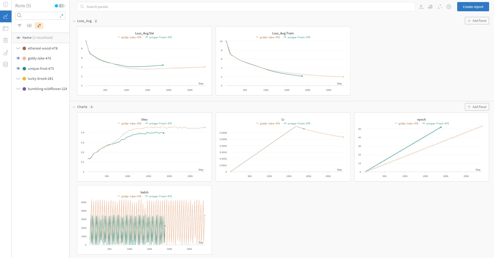

# Attention Is All You Need Paper Implementation

This is my from-scratch implementation of the original transformer architecture from the following paper: [Vaswani, Ashish, et al. "Attention is all you need." Advances in neural information processing systems. 2017.](https://arxiv.org/abs/1706.03762)

<a href=https://arxiv.org/pdf/1706.03762.pdf>
  <p align="center">
    
  </p>
</a>

## Table of Contents
* [About](#about)
* [Setup](#setup)
  * [Environment](#environment)
  * [Pretrained Models](#pretrained-models)
* [Usage](#usage)
  * [Training](#training)
  * [Inference](#inference)
* [Data](#data)
* [Architecture](#architecture)
* [Weights and Biases Logs](#weights-and-biases-logs)
* [Citation](#citation)
* [License](#license)


# About
*"We propose a new simple network architecture, the Transformer,
based solely on attention mechanisms, dispensing with recurrence and convolutions
entirely. " - Abstract*  
  
Transformers came to be a groundbreaking advance in neural network architectures which revolutionized what we can do with NLP and beyond. To name a few applications consider the [application of BERT to Google search](https://blog.google/products/search/search-language-understanding-bert/) and GPT to [Github Copilot](https://copilot.github.com/). Those architectures are upgrades on the original transformer architecture described in this seminal paper. **The goal of this repository is to provide an implementation that is easy to follow and understand while reading the paper. Setup is easy and everything is runnable on CPU for learning purposes.**


✔️ Highly customizable configuration and training loop  
✔️ Runnable on CPU and GPU  
✔️ W&B integration for detailed logging of every metric  
✔️ Pretrained models and their training details  
✔️ Gradient Accumulation  
✔️ Label smoothing  
✔️ BPE and WordLevel Tokenizers  
✔️ Dynamic Batching  
✔️ Batch Dataset Processing  
✔️ Bleu-score calculation during training  
✔️ Documented dimensions for every step of the architecture  
✔️ Shown progress of translation for an example after every epoch  
✔️ Tutorial notebook

# Setup

## Environment
Using Miniconda/Anaconda:
1. `cd path_to_repo`
2. `conda env create`
3. `conda activate attention-is-all-you-need-paper`

***Note**: Depending on your GPU you might need to switch cudatoolkit to version 10.2*

## Pretrained Models
To download the pretrained model and tokenizer run:
```
python scripts/download_pretrained.py
```
***Note**: If prompted about wandb setting select option 3*

You can see all the information and results for pretrained models at this [project link](https://wandb.ai/bkoch4142/attention-is-all-you-need-paper/runs/1rbhz2as?workspace=user-bkoch4142).

# Usage

## Training 
Before starting training you can either **choose a configuration out of available ones or create your own** inside a single file `src/config.py`. The available parameters to customize, sorted by categories, are:

- **Run** 🚅:
   - RUN_NAME - Name of a training run
   - RUN_DESCRIPTION - Description of a training run
   - RUNS_FOLDER_PTH - Saving destination of a training run
- **Data** 🔡:
   - DATASET_SIZE - Number of examples you want to include from WMT14 en-de dataset (max 4,500,000)
   - TEST_PROPORTION - Test set proportion
   - MAX_SEQ_LEN - Maximum allowed sequence length
   - VOCAB_SIZE - Size of the vocabulary (good choice is dependant on the tokenizer)
   - TOKENIZER_TYPE - 'wordlevel' or 'bpe'
- **Training** 🏋️‍♂️:
   - BATCH_SIZE - Batch size
   - GRAD_ACCUMULATION_STEPS - Over how many batches to accumulate gradients before optimizing the parameters
   - WORKER_COUNT - Number of workers used in dataloaders
   - EPOCHS - Number of epochs
- **Optimizer** 📉:
   - BETAS - Adam beta parameter
   - EPS - Adam eps parameter
- **Scheduler** ⏲️:
   - N_WARMUP_STEPS - How many warmup steps to use in the scheduler
- **Model** 🤖:
   - D_MODEL - Model dimension 
   - N_BLOCKS - Number of encoder and decoder blocks
   - N_HEADS - Number of heads in the Multi-Head attention mechanism
   - D_FF - Dimension of the Position Wise Feed Forward network 
   - DROPOUT_PROBA - Dropout probability
- **Other** 🧰:
   - DEVICE - 'gpu' or 'cpu'
   - MODEL_SAVE_EPOCH_CNT - After how many epochs to save a model checkpoint
   - LABEL_SMOOTHING - Whether to apply label smoothing

Once you decide on the configuration **edit the config_name in train.py** and do:
```
$ cd src
$ python train.py
```
## Inference
For inference I created a simple app with [Streamlit](https://streamlit.io/) which runs in your browser. Make sure to train or download the pretrained models beforehand. The app looks at the `model` directory for model and tokenizer checkpoints.
```
$ streamlit run app/inference_app.py
```


https://user-images.githubusercontent.com/57716666/144402132-37566499-f79e-4828-857a-2c2b820f2094.mp4


# Data 

Same WMT 2014 data is used for the English-to-German translation task. Dataset contains about 4,500,000 sentence pairs but you can manually specify the dataset size if you want to lower it and see some results faster. **When training is initiated the dataset is automatically downloaded, preprocessed, tokenized and dataloaders are created.** Also, a custom batch sampler is used for dynamic batching and padding of sentences of similar lengths which speeds up training. HuggingFace 🤗 datasets and tokenizers are used to achieve this very fast.


# Architecture 
The original transformer architecture presented in this paper consists of an encoder and decoder part purposely included to match the seq2seq problem type of machine translation. There are also encoder-only (e.g. BERT) and decoder-only (e.g. GPT) transformer architectures, those won't be covered here. One of the main features of transformers , in general, is parallelized sequence processing which RNN's lack. Main ingredient here is the [attention mechanism](https://arxiv.org/abs/1409.0473) which enables creating modified word representations (attention representations) that take into account the word's meaning in relation to other words in a sequence (e.g. the word "bank" can represent a financial institution or land along the edge of a river as in "river bank"). Depending on how we think about a word we may choose to represent it differently. This transcends the limits of traditional word embeddings.

<a>
  <p align="center">
    
  </p>
</a>

**For a detailed walkthrough of the architecture check the `notebooks/tutorial.ipynb`**

## Weights and Biases Logs
[Weights and Biases](https://wandb.ai/site) is a very powerful tool for MLOps. I integrated it with this project to automatically provide very useful logs and visualizations when training. In fact, you can take a look at how the training looked for the pretrained models at this [project link](https://wandb.ai/bkoch4142/attention-is-all-you-need-paper/runs/1rbhz2as?workspace=user-bkoch4142). All logs and visualizations are synced real time to the cloud. 



When you start training you will be asked:
```
wandb: (1) Create W&B account
wandb: (2) Use an existing W&B account
wandb: (3) Don't visualize my results
wandb: Enter your choice: 
```

For creating and syncing the visualizations to the cloud you will need a **W&B account**. Creating an account and using it won't take you more than a minute and it's free. If you don't want to visualize results select option 3.


## Citation
Please use this bibtex if you want to cite this repository:
```
@misc{Koch2021attentionisallyouneed,
  author = {Koch, Brando},
  title = {attention-is-all-you-need},
  year = {2021},
  publisher = {GitHub},
  journal = {GitHub repository},
  howpublished = {\url{https://github.com/brandokoch/attention-is-all-you-need-paper}},
}
```

## License
This repository is under an MIT License

[](https://github.com/bkoch4142/attention-is-all-you-need-paper/blob/master/LICENSE)


